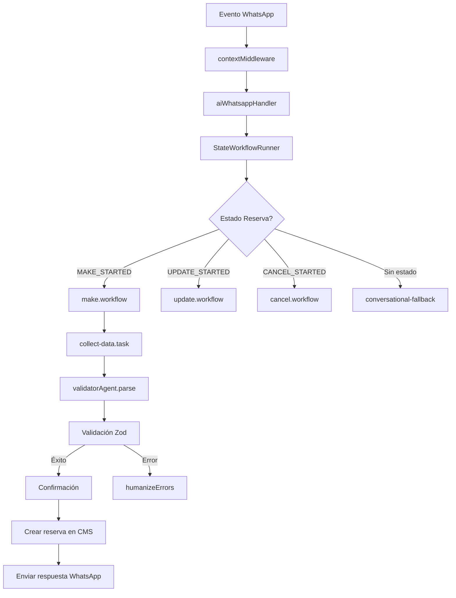

# Resumen de la Arquitectura del Proyecto Chat Agent

📋 Descripción General

El proyecto **Chat Agent** es un agente conversacional inteligente diseñado para gestionar reservas (crear, actualizar, cancelar) a través de WhatsApp. Utiliza modelos de lenguaje (LLM) para entender la intención del usuario, validar datos y mantener conversaciones naturales, todo integrado con sistemas de negocio externos.

## 🏗️ Arquitectura por Capas

### **1. Capa de Entrada (HTTP/API)**
- **Framework**: Hono (optimizado para entornos serverless/edge)
- **Punto de entrada**: `src/index.ts`
- **Endpoints principales**:
  - `POST /received-messages/:businessId` → Procesa mensajes de WhatsApp
  - `POST /test-ai/:businessId` → Endpoint de pruebas
- **Middleware**: CORS configurado para dominios específicos (WAHA_API, CMS_API)

### **2. Capa de Middleware**
- **`contextMiddleware`**: Extrae y valida datos del evento de WhatsApp
  - Parsea el JSON del evento
  - Obtiene información del negocio y cliente desde CMS
  - Establece variables de contexto (chatKey, reservationKey, etc.)
  - Valida mensaje, negocio y teléfono del cliente

### **3. Capa de Handlers**
- **`aiWhatsappHandler`**: Flujo principal para mensajes de WhatsApp
  1. Valida que el evento sea de tipo "message"
  2. Ejecuta `whatsAppService.beforeSend()` (marca como visto + typing indicators)
  3. Ejecuta el workflow de reservas (`runReservationWorkflow`)
  4. Envía la respuesta formateada para WhatsApp
- **`aiTestHandler`**: Handler para pruebas del agente

### **4. Capa de Workflows (Máquina de Estados)**
- **`StateWorkflowRunner`**: Patrón de máquina de estados finitos
  - Ejecuta handlers específicos según el estado actual de la reserva
  - Estados: `MAKE_STARTED`, `MAKE_VALIDATED`, `UPDATE_STARTED`, etc.
- **Workflows principales**:
  - **`make.workflow`**: Creación de reservas
  - **`update.workflow`**: Actualización de reservas
  - **`cancel.workflow`**: Cancelación de reservas
- **`conversational-fallback`**: Maneja preguntas generales del cliente fuera del flujo

#### **Ejecución Durable con DBOS**
- **Propósito**: Garantizar la ejecución confiable de workflows críticos (creación, actualización y cancelación de reservas) mediante patrones de durable execution.
- **Implementación**: Integración con DBOS (Database Operating System) para workflows que requieren tolerancia a fallos, resiliencia y garantías de exactamente una vez (exactly‑once).
- **Beneficios**:
  - **Resiliencia**: Los workflows sobreviven a fallos de infraestructura, reinicios y despliegues.
  - **Tolerancia a fallos**: Cada paso se persiste en una base de datos transaccional, permitiendo recuperación automática.
  - **Escalabilidad**: Ejecución distribuida con co‑routines gestionadas por DBOS.
  - **Observabilidad**: Trazabilidad completa de la ejecución con logs estructurados.
- **Workflows adaptados**: `make.workflow`, `update.workflow` y `cancel.workflow` utilizan DBOS para orquestar tareas de larga duración y llamadas externas.

### **5. Capa de Servicios**
- **`whatsAppService`**: Integración con WAHA API (WhatsApp Web API)
  - Envío de mensajes, contactos, ubicaciones
  - Gestión de estados (seen, typing)
- **`cmsService`**: Integración con Payload CMS
  - CRUD de negocios, clientes y reservas
  - Validación de disponibilidad
  - Cache en Redis para optimización
- **`chatHistoryService`**: Historial de conversaciones en Redis
  - Almacena últimos 20 mensajes por chat
  - Expiración automática (2 horas)
- **`reservationCacheService`**: Estado temporal de reservas en proceso

### **6. Capa de Inteligencia Artificial (LLM)**
- **Proveedor**: Cloudflare Workers AI (`@cf/ibm-granite/granite-4.0-h-micro`)
- **Componentes**:
  - **Clasificadores**: `customerIntentClassifier`, `inputIntentClassifier`
  - **Agente validador**: `validatorAgent` (parse + error humanization)
  - **Agente humanizador**: `humanizerAgent` (respuestas naturales)
- **Prompts**: Separados en `src/llm/prompts/` (sistema, validación, clasificación)

### **7. Capa de Almacenamiento**
- **Redis**: Cache de negocio, clientes, historial de chat y estado de reservas
- **Payload CMS**: Fuente principal de datos (negocios, clientes, reservas)
- **Estructuras de cache**:
  - `business:{id}` → Información del negocio (12 horas)
  - `customer:business:{id}:phoneNumber:{phone}` → Datos del cliente (7 días)
  - `chat:{businessId}:{phone}` → Historial de conversación (2 horas)
  - `reservation:{businessId}:{phone}` → Estado de reserva en proceso

### **8. Capa de Observabilidad y Monitoreo**
- **Sentry**: Plataforma de monitoreo de errores y performance en tiempo real.
  - **Error Tracking**: Captura automática de excepciones no controladas, tanto en el runtime (Bun) como en handlers asíncronos.
  - **Logging Estructurado**: Integración con Sentry para enriquecer logs con contexto (businessId, phone, traceId).
  - **Tracing Distribuido**: Seguimiento de transacciones a través de los diferentes servicios (WhatsApp, CMS, LLM, Redis).
- **Logging en Producción**:
  - **Niveles**: `error`, `warn`, `info`, `debug` configurados por entorno.
  - **Formato**: JSON estructurado para ingestión en herramientas como Datadog o Elasticsearch.
  - **Contexto**: Cada log incluye campos como `service: "chat-agent"`, `environment`, `businessId`, `phone`, `workflowState`.
- **Métricas**:
  - **Latencia por endpoint**: Tiempos de respuesta de los handlers.
  - **Tasa de éxito/error**: Por workflow y por tipo de intención.
  - **Uso de Redis y CMS**: Contadores de hits/misses de cache y latencia de APIs externas.

## 🔄 Flujo de Datos Principal



## 🛠️ Tecnologías Clave

| Tecnología | Uso | Versión |
|------------|-----|---------|
| **Bun** | Runtime y package manager | Latest |
| **Hono** | Framework web minimalista | ^4.10.8 |
| **TypeScript** | Lenguaje principal | ^5 |
| **Cloudflare Workers AI** | Modelos de lenguaje | granite‑4.0‑h‑micro |
| **Redis** | Cache y estado temporal | Bun RedisClient |
| **Payload CMS** | Gestión de contenido | API externa |
| **WAHA API** | Integración con WhatsApp | API externa |
| **Zod** | Validación de esquemas | ^4.1.13 |
| **Sentry** | Error tracking y observabilidad | ^8.0.0 |
| **DBOS** | Ejecución durable para workflows críticos | ^0.1.0 |

## 📁 Estructura de Directorios

```
src/
├── index.ts                    # Punto de entrada
├── handlers/                   # Handlers HTTP
├── middlewares/               # Middlewares de contexto
├── services/                  # Servicios externos (WhatsApp, CMS, Cache)
├── workflows/                 # Flujos de negocio principal
│   ├── reservations/          # Workflows de reservas
│   └── appointments/          # Workflows de citas
├── workflow-fsm/              # Máquina de estados
├── llm/                       # Integración con IA
│   ├── prompts/              # Prompts del sistema
│   ├── validators/           # Validadores de datos
│   └── llm.config.ts         # Configuración de IA
├── types/                     # Tipos TypeScript
├── storage/                   # Configuración de almacenamiento
├── helpers/                   # Utilidades
└── test/                      # Pruebas
```

## 🔌 Dependencias Externas

1. **WAHA API** (`WAHA_API`): Servicio de WhatsApp Web
2. **Payload CMS** (`CMS_API`): Sistema de gestión de contenido
3. **Cloudflare Workers AI**: Modelos de lenguaje
4. **Redis**: Base de datos en memoria
5. **Sentry**: Plataforma de observabilidad y error tracking
6. **DBOS**: Framework de ejecución durable (base de datos transaccional)

## 🚀 Despliegue y Ejecución

- **Desarrollo**: `bun run dev` (hot-reload)
- **Build**: `bun run build` (target: bun)
- **Producción**: Docker + Cloudflare Workers compatible
- **Variables de entorno**: WAHA_API, CMS_API, CLOUDFLARE_AUTH_TOKEN, REDIS_URL, SENTRY_DSN, DBOS_DATABASE_URL

## 🎯 Patrones de Diseño Destacados

1. **State Machine**: Para flujos de reservas complejos
2. **Middleware Chain**: Para procesamiento de requests
3. **Service Layer**: Para abstraer APIs externas
4. **CQRS Light**: Separación de lectura (cache) y escritura (CMS)
5. **Strategy Pattern**: Diferentes workflows según estado
6. **Durable Execution Pattern**: Para garantizar la finalización confiable de workflows largos mediante persistencia del estado de ejecución.

## 📈 Consideraciones de Escalabilidad

- **Stateless**: El estado se almacena en Redis, no en memoria
- **Cache agresivo**: Reduce llamadas a CMS y WAHA API
- **Edge-ready**: Hono es compatible con Cloudflare Workers
- **Modular**: Los workflows pueden extenderse fácilmente
- **Resiliencia**: Ejecución durable con DBOS asegura que los workflows críticos se completen incluso ante fallos
- **Observabilidad**: Monitoreo integral con Sentry permite detectar y diagnosticar problemas rápidamente

Esta arquitectura permite manejar conversaciones complejas de reservas manteniendo un código mantenible y desacoplado de las APIs externas, ahora con mayor resiliencia, tolerancia a fallos y capacidad de observabilidad en producción.
