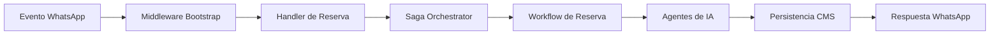

Resumen de la Arquitectura del Proyecto Chat Agent

Basándome en el análisis del código, puedo proporcionarte un resumen detallado de la arquitectura del proyecto, con especial enfoque en la implementación de **Domain-Driven Design (DDD)**.

### 🏗️ **Arquitectura General**

El proyecto sigue una arquitectura en capas claramente definida, organizada según los principios de DDD:

```
src/
├── domain/                    # Capa de Dominio (Core Domain)
│   ├── restaurant/           # Subdominio de Restaurantes
│   ├── real-state/           # Subdominio de Bienes Raíces  
│   ├── e-commerce/           # Subdominio de E-commerce
│   └── utilities/            # Utilidades compartidas
├── application/              # Capa de Aplicación
│   ├── handlers/            # Handlers HTTP por dominio
│   ├── use-cases/           # Casos de uso específicos
│   ├── patterns/            # Patrones de diseño
│   ├── agents/              # Agentes de IA
│   └── middlewares/         # Middlewares de contexto
└── infraestructure/         # Capa de Infraestructura
    ├── adapters/            # Adaptadores para servicios externos
    ├── http/               # Clientes HTTP
    ├── cache/              # Implementación de cache
    └── logging/            # Configuración de logging
```

### 🔄 **Flujo de Datos Principal**



### 🎯 **Implementación de DDD**

#### **1. Capa de Dominio (Domain Layer)**
- **Entidades y Value Objects**: Definidos en `domain/restaurant/reservations/reservation.types.ts`
- **Esquemas de Validación**: Usando Zod para invariantes de dominio (`schemas.ts`)
- **Contextos Específicos de Dominio**: 
  ```chatbots/chat-agent/src/domain/restaurant/context.types.ts#L1-12
  export type RestaurantCtx = {
    whatsappEvent: string;
    businessId: string;
    business: Business;
    customer?: Customer;
    session: string;
    customerPhone: string;
    customerMessage: string;
    chatKey: string;
    reservationKey: string;
    RESERVATION_STATE: Partial<ReservationState> | undefined;
  };
  ```
- **Lenguaje Ubicuo**: Términos como `ReservationState`, `CustomerIntent`, `FlowOption`

#### **2. Capa de Aplicación (Application Layer)**
- **Casos de Uso**: Organizados por dominio (restaurante, real-state, e-commerce)
- **Handlers Específicos de Dominio**: 
  ```chatbots/chat-agent/src/application/handlers/restaurant/reservation/whatsapp-reservation.handler.ts#L1-40
  export const whatsappReservationHandler: Handler<
    DomainCtx<RestaurantCtx>
  > = async (c) => {
    const ctx = {
      session: c.get("session"),
      whatsappEvent: c.get("whatsappEvent"),
      RESERVATION_STATE: c.get("RESERVATION_STATE"),
      customerMessage: c.get("customerMessage"),
      customerPhone: c.get("customerPhone"),
      business: c.get("business"),
      customer: c.get("customer"),
      businessId: c.get("businessId"),
      chatKey: c.get("chatKey"),
      reservationKey: c.get("reservationKey"),
    } satisfies RestaurantCtx;
    // ... lógica del handler
  };
  ```
- **Patrones de Diseño**:
  - **Saga Orchestrator**: Para coordinación transaccional
  - **State Machine Workflow**: Para flujos de reserva
  - **Circuit Breaker**: Para resiliencia

#### **3. Capa de Infraestructura (Infrastructure Layer)**
- **Adaptadores**: Para servicios externos (WhatsApp, CMS, Redis)
- **Clientes HTTP**: Separados por servicio
- **Ejecución Durable**: Integración con DBOS para workflows

### 🔧 **Patrones de Diseño Destacados**

#### **Saga Orchestrator**
Implementación completa del patrón Saga para gestión transaccional:
```chatbots/chat-agent/src/application/patterns/saga-orchestrator/saga-orchestrator.ts#L1-100
export class SagaOrchestrator<
  Context,
  T extends SagaBag,
  Key extends string | number | bigint,
> {
  private readonly ctx: Readonly<Context>;
  private steps: ISagaStep<Context, T, Key>[] = [];
  private bag = {} as Record<`${SagaMode}:${Key}`, T>;
  private executedSteps: string[] = [];
  
  // Métodos para ejecución y compensación
}
```

#### **Workflows por Estado**
Máquina de estados para flujos de reserva:
```chatbots/chat-agent/src/application/use-cases/workflows/reservations/reservation.workflow.ts#L1-30
export async function reservationWorkflow(ctx: RestaurantCtx): Promise<string> {
  const status = ctx.RESERVATION_STATE?.status;
  const business = ctx.business;
  const subWorkflow = new StateWorkflowRunner(ctx, status);

  subWorkflow
    .on("MAKE_STARTED", makeWorkflow.started)
    .on("MAKE_VALIDATED", makeWorkflow.validated)
    .on("UPDATE_STARTED", updateWorkflow.started)
    .on("UPDATE_VALIDATED", updateWorkflow.validated)
    .on("CANCEL_STARTED", cancellWorkflow.started);
}
```

### 🧠 **Arquitectura de IA Integrada**

- **Clasificadores de Intención**: `customerIntentClassifier`, `inputIntentClassifier`
- **Agente Validador**: `validatorAgent` para parseo y humanización de errores
- **Agente Humanizador**: `humanizerAgent` para respuestas naturales
- **Proveedor LLM**: Cloudflare Workers AI (`granite-4.0-h-micro`)

### 💾 **Estrategia de Persistencia**

- **Cache Agresivo**: Redis para negocio, clientes, historial de chat
- **Fuente de Verdad**: Payload CMS para datos maestros
- **Estado Transaccional**: DBOS para ejecución durable de workflows

### ✅ **Buenas Prácticas DDD Implementadas**

1. **Separación Clara de Capas**: Dominio, Aplicación, Infraestructura
2. **Contextos Delimitados**: Restaurant, RealState, ECommerce
3. **Entidades Ricas**: Con validaciones y comportamiento
4. **Anti-Corrupción Layer**: Adaptadores para APIs externas
5. **Lenguaje Ubicuo**: Términos consistentes en todo el código

### 🔄 **Dependencias Externas y Acoplamiento**

Las dependencias externas están aisladas en la capa de infraestructura:
- **WAHA API**: WhatsApp Web API
- **Payload CMS**: Sistema de gestión de contenido
- **Cloudflare Workers AI**: Modelos de lenguaje
- **Redis**: Cache y estado temporal
- **DBOS**: Ejecución durable para workflows

### 📈 **Recomendaciones para Mejorar la Arquitectura DDD**

1. **Repositorios Explícitos**: Considerar agregar interfaces de repositorio en la capa de dominio
2. **Eventos de Dominio**: Implementar eventos de dominio para desacoplar lógica
3. **Especificaciones**: Patrón Specification para reglas de negocio complejas
4. **Módulos**: Agrupar entidades relacionadas en módulos dentro de cada subdominio

Esta arquitectura proporciona una base sólida para escalar el sistema mientras mantiene el código mantenible y alineado con los objetivos de negocio. La separación clara de responsabilidades permite evolucionar cada capa independientemente.
