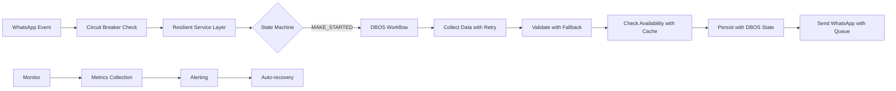

Excelente arquitectura 🏗️. Has construido un sistema robusto y bien estructurado. Veo que has implementado correctamente **DBOS para ejecución durable** en los workflows críticos, lo cual es clave para la resiliencia del sistema.

## 🔍 Análisis de tu implementación actual

### ✅ **Lo que está funcionando bien:**

1. **Separación clara de responsabilidades** por capas
2. **Patrón de máquina de estados** bien implementado en `StateWorkflowRunner`
3. **Integración DBOS correcta** en workflows críticos
4. **Caching estratégico** con Redis para performance
5. **Observabilidad completa** con Sentry + logging estructurado

### ⚠️ **Áreas que podrían mejorar:**

## 🚀 **Recomendaciones de mejora:**

### 1. **Patrones de resiliencia para servicios externos**

```typescript
// src/services/resilient-service.ts
export class ResilientService {
  private readonly maxRetries: number;
  private readonly backoffMs: number;

  constructor(config: { maxRetries?: number; backoffMs?: number } = {}) {
    this.maxRetries = config.maxRetries ?? 3;
    this.backoffMs = config.backoffMs ?? 1000;
  }

  async executeWithRetry<T>(
    operation: () => Promise<T>,
    context: { service: string; operation: string }
  ): Promise<T> {
    let lastError: Error;
    
    for (let attempt = 1; attempt <= this.maxRetries; attempt++) {
      try {
        return await operation();
      } catch (error) {
        lastError = error as Error;
        
        logger.warn(`Service call failed`, {
          ...context,
          attempt,
          maxRetries: this.maxRetries,
          error: error.message
        });

        if (attempt === this.maxRetries) break;
        
        // Exponential backoff
        await this.sleep(this.backoffMs * Math.pow(2, attempt - 1));
      }
    }
    
    throw lastError!;
  }

  private sleep(ms: number): Promise<void> {
    return new Promise(resolve => setTimeout(resolve, ms));
  }
}

// Uso en cmsService
const resilient = new ResilientService();
const availability = await resilient.executeWithRetry(
  () => cmsService.checkAvailability(params),
  { service: 'cms', operation: 'checkAvailability' }
);
```

### 2. **Circuit Breaker para APIs externas**

```typescript
// src/services/circuit-breaker.ts
export class CircuitBreaker {
  private state: 'CLOSED' | 'OPEN' | 'HALF_OPEN' = 'CLOSED';
  private failureCount = 0;
  private readonly threshold: number;
  private readonly timeout: number;
  private lastFailureTime: number = 0;

  constructor(config: { threshold?: number; timeout?: number } = {}) {
    this.threshold = config.threshold ?? 5;
    this.timeout = config.timeout ?? 30000; // 30 seconds
  }

  async execute<T>(operation: () => Promise<T>): Promise<T> {
    if (this.state === 'OPEN') {
      if (Date.now() - this.lastFailureTime > this.timeout) {
        this.state = 'HALF_OPEN';
      } else {
        throw new Error('Circuit breaker is OPEN');
      }
    }

    try {
      const result = await operation();
      
      if (this.state === 'HALF_OPEN') {
        this.reset();
      }
      
      return result;
    } catch (error) {
      this.recordFailure();
      throw error;
    }
  }

  private recordFailure(): void {
    this.failureCount++;
    this.lastFailureTime = Date.now();
    
    if (this.failureCount >= this.threshold) {
      this.state = 'OPEN';
      logger.error('Circuit breaker OPEN', {
        failureCount: this.failureCount,
        threshold: this.threshold
      });
    }
  }

  private reset(): void {
    this.state = 'CLOSED';
    this.failureCount = 0;
  }
}
```

### 3. **Mejora en el manejo de estado con DBOS**

```typescript
// src/workflows/dbos-state-manager.ts
export class DBOSStateManager {
  static async saveReservationState(
    key: string,
    state: Partial<ReservationState>,
    metadata?: { workflowId?: string; stepId?: number }
  ) {
    return await DBOS.runStep(async () => {
      const existing = await reservationCacheService.get(key);
      const updated = {
        ...existing,
        ...state,
        _metadata: {
          ...existing?._metadata,
          lastUpdated: new Date().toISOString(),
          ...metadata
        }
      };
      
      await reservationCacheService.save(key, updated);
      return updated;
    }, { name: 'DBOSStateManager.saveReservationState' });
  }

  static async recoverWorkflowState(workflowId: string) {
    // Recupera estado desde operation_outputs de DBOS
    // Implementación específica según tu schema DBOS
  }
}
```

### 4. **Testing de workflows con DBOS**

```typescript
// src/test/workflow-test-utils.ts
export class WorkflowTestHarness {
  static async testWorkflowRecovery(
    workflowFn: () => Promise<any>,
    simulateFailureAtStep?: number
  ) {
    // 1. Ejecuta workflow normalmente
    const normalResult = await workflowFn();
    
    // 2. Simula fallo y recuperación
    if (simulateFailureAtStep) {
      // Mock DBOS para simular fallo en step específico
      // Verifica que el workflow se puede recuperar
    }
    
    return { normalResult };
  }
}
```

### 5. **Configuración específica para Bun + DBOS**

```json
// bunfig.toml o package.json scripts
{
  "scripts": {
    "build:dbos": "bun build ./src/index.ts --outdir ./dist --target node --external @dbos-inc/dbos-sdk --external superjson --external zod --external @dbos-inc/dbos-runtime",
    "start:dbos": "DBOS_DATABASE_URL=postgresql://... DBOS_WORKFLOW_TIMEOUT=300000 bun run dist/index.js"
  }
}
```

### 6. **Métricas específicas para workflows DBOS**

```typescript
// src/monitoring/dbos-metrics.ts
export const DBOSMetrics = {
  trackWorkflowExecution: async (
    workflowName: string,
    duration: number,
    success: boolean
  ) => {
    // Enviar métricas a Sentry/Datadog
    Sentry.metrics.distribution('dbos.workflow.duration', duration, {
      tags: { workflow: workflowName, success: success.toString() }
    });
    
    logger.info('Workflow execution tracked', {
      workflow: workflowName,
      durationMs: duration,
      success,
      service: 'chat-agent'
    });
  }
};
```

## 📊 **Dashboard de monitoreo sugerido:**

```yaml
# Grafana/Prometheus metrics a monitorear:
metrics:
  - dbos_workflow_duration_seconds
  - dbos_step_success_count
  - dbos_step_failure_count
  - redis_cache_hit_ratio
  - cms_api_latency_seconds
  - llm_processing_time_seconds
  - whatsapp_message_delivery_status
```

## 🔄 **Flujo mejorado con resiliencia:**



## 🎯 **Próximos pasos recomendados:**

1. **Implementar Circuit Breaker** para CMS y WAHA APIs
2. **Agregar colas asíncronas** para envío de mensajes WhatsApp
3. **Crear dashboard de métricas** específicas de DBOS
4. **Implementar tests de recuperación** de workflows
5. **Documentar procedimientos** de rollback/recovery

**¿En qué aspecto te gustaría profundizar primero?** ¿Resiliencia de APIs, monitoreo de DBOS, o testing de workflows?