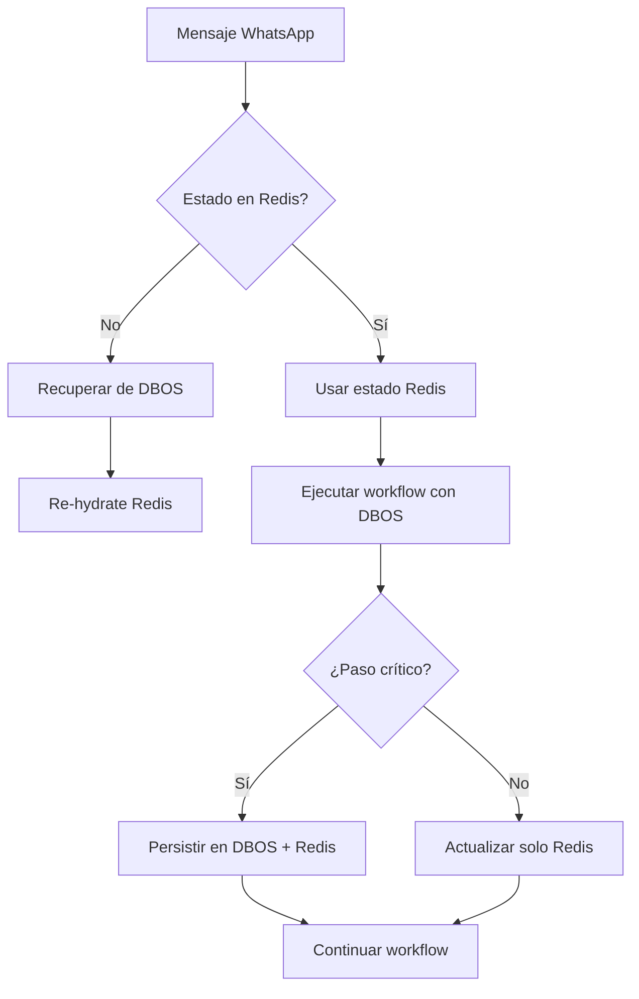

# Redis and DBOS

### redis es usado por reservationCacheService, para recolectar datos de usuario (input) entre requests, solo eso. Que opinas? deberia elimanar redis donde use DBOS? o ambos estan bien usados ?

**No, deberías mantener Redis y usar ambos sistemas complementariamente.** Cada uno cumple un propósito diferente en tu arquitectura. Aquí está el análisis:

## 🎯 **Roles claros de cada sistema:**

### **Redis - Cache de alta velocidad & Estado de sesión**
```typescript
// Propósito: Datos efímeros de alta velocidad
reservationCacheService.save(reservationKey, {
  ...reservation,
  ...mergedData,
  attempts: retries,
  lastUpdated: Date.now()  // ⏱️ Estado temporal
});
```

### **DBOS - Ejecución durable & Persistencia de workflows**
```typescript
// Propósito: Garantizar ejecución de workflows complejos
await DBOS.runStep(
  () => cmsService.checkAvailability(params),
  { name: "cmsService.checkAvailability" }  // 🔄 Estado durable del workflow
);
```

## 📊 **Matriz de decisiones: ¿Qué usar y cuándo?**

| **Caso de uso** | **Redis** | **DBOS** | **Razón** |
|-----------------|-----------|----------|-----------|
| **Estado de conversación actual** | ✅ **Sí** | ❌ No | Necesita baja latencia (<10ms) |
| **Historial de chat (últimos 20 msjs)** | ✅ **Sí** | ❌ No | Acceso rápido para contexto LLM |
| **Cache de datos de negocio** | ✅ **Sí** | ❌ No | Reduce llamadas a CMS |
| **Workflow de reserva (multi-step)** | ❌ No | ✅ **Sí** | Necesita durabilidad y recovery |
| **Validación compleja con LLM** | ❌ No | ✅ **Sí** | LLM calls son costosas, necesitan garantías |
| **Check de disponibilidad CMS** | ❌ No | ✅ **Sí** | Operación crítica, necesita retry automático |
| **Persistencia final de reserva** | ❌ No | ✅ **Sí** | Transaccionalidad con CMS |

## 🏗️ **Arquitectura híbrida recomendada:**

```typescript
// src/services/hybrid-state.service.ts
export class HybridStateService {
  // Redis: Para acceso rápido al estado actual
  static async getSessionState(key: string): Promise<Partial<ReservationState> | null> {
    return await reservationCacheService.get(key);
  }

  // DBOS: Para persistencia durable del workflow
  static async saveWorkflowState(
    workflowId: string,
    state: Partial<ReservationState>,
    stepId?: number
  ) {
    await DBOS.runStep(async () => {
      // Guarda en DBOS para durabilidad
      await this.saveToDBOS(workflowId, state, stepId);
      // También en Redis para acceso rápido
      await reservationCacheService.save(`workflow:${workflowId}`, state);
    }, { name: 'HybridStateService.saveWorkflowState' });
  }

  // Recuperación ante fallos
  static async recoverSession(workflowId: string, phone: string) {
    const redisState = await reservationCacheService.get(`workflow:${workflowId}`);
    if (redisState) return redisState;

    // Si Redis falló, recupera de DBOS
    const dbosState = await this.recoverFromDBOS(workflowId);
    if (dbosState) {
      // Re-hydrate Redis
      await reservationCacheService.save(`workflow:${workflowId}`, dbosState);
      await reservationCacheService.save(`reservation:${phone}`, dbosState);
    }
    return dbosState;
  }
}
```

## 🔄 **Flujo mejorado con ambos sistemas:**



## ⚡ **Performance considerations:**

```typescript
// Latencia típica:
const latencies = {
  redis: '1-5ms',      // ✅ Ideal para estado de sesión
  dbos: '50-100ms',    // ✅ Aceptable para workflows duraderos
  cms: '200-500ms',    // ⚠️ Externa, necesita retry
  llm: '500-2000ms'    // ⚠️ Costosa, necesita durabilidad
};

// Ejemplo: Optimización de acceso
async function getReservationState(phone: string, businessId: string) {
  const redisKey = `reservation:${businessId}:${phone}`;
  
  // 1. Primero Redis (rápido)
  const cached = await reservationCacheService.get(redisKey);
  if (cached) return cached;
  
  // 2. Si no existe, buscar workflows activos en DBOS
  const activeWorkflows = await this.findActiveWorkflows(phone, businessId);
  if (activeWorkflows.length > 0) {
    // Recuperar el más reciente y cachear en Redis
    const latest = await this.recoverFromDBOS(activeWorkflows[0]);
    if (latest) {
      await reservationCacheService.save(redisKey, latest);
      return latest;
    }
  }
  
  return null;
}
```

## 🚨 **Riesgos de eliminar Redis:**

1. **Alta latencia en conversaciones**: DBOS + PostgreSQL es 10-20x más lento que Redis
2. **Sobrecarga de DBOS**: Usarlo para cache es anti-patrón
3. **Sin cache de negocio/cliente**: Cada mensaje requeriría llamadas a CMS
4. **Pérdida de historial de chat**: Crucial para contexto conversacional
5. **Mayor costo**: PostgreSQL es más caro por operación que Redis

## ✅ **Conclusión: Mantén ambos con responsabilidades claras**

```typescript
// Tu arquitectura actual está BIEN:
export async function collecDataSteps({
  reservation,  // ← Desde Redis (rápido)
  // ...
}: Args) {
  // Pasos críticos con DBOS para durabilidad
  await DBOS.runStep(() => validatorAgent.parse(...), {
    name: "validatorAgent.parse"
  });
  
  // Estado de sesión en Redis para siguiente interacción
  await reservationCacheService.save(reservationKey, {
    ...reservation,
    ...mergedData,  // ← Para próxima llamada
    attempts: retries
  });
}
```

**¿Qué ajustar?** Tal vez agregar:
1. **Sincronización automática**: Cuando DBOS persiste un paso, también actualizar Redis
2. **TTL inteligente**: Redis con expiración, DBOS sin expiración
3. **Métricas de cache**: Hit/miss ratio para optimizar

**¿Quieres que diseñemos la sincronización automática entre ambos sistemas?**
